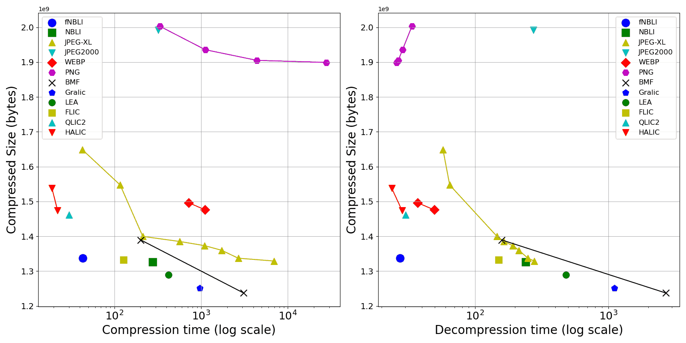
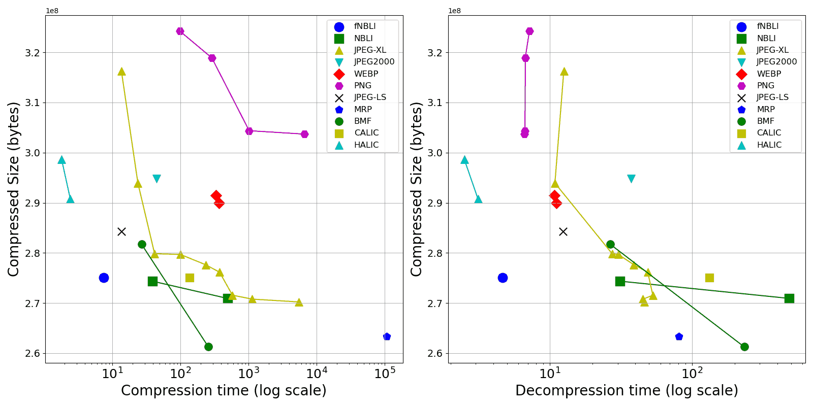

# Lossless Image Compression Benchmark

This repo is a comparison of many lossless image compression formats when compressing **RGB 24-bit** and **Gray 8-bit** images, inspired by [LPCB authored by Alex Rhatushnyak](http://qlic.altervista.org/) , but use a larger dataset, and provides a convenient Python script for you to reproduce the result.

- **Compress Formats**: Many formats such as PNG, JPEG-XL, etc. See [**README_FormatList.md**](./README_FormatList.md) . Note that all formats in this test will be run in **strictly lossless compression mode**. (If you want to add any other formats, please submit an issue).
- **Comparison Metrics**:
  - Compressed Size (the smaller the better);
  - Compress Time (the smaller the better);
  - Decompress Time (the smaller the better);
- **Benchmark data**:
  - [**585 .pnm uncompressed RGB 24-bit images**](README_RGB24dataset.md), totaling **4 GB**.
  - [**64 .pnm uncompressed Gray 8-bit images**](README_Gray8dataset.md), totaling **751 MB**.
  - Note: **.pnm** is a simple image format which store raw pixels, see [PNM file spec](https://netpbm.sourceforge.net/doc/pnm.html) for detail.
- **Test Environment**:
  - My PC (Intel Core i7 12700H, 16GB DDR4 in 3200MHz, Windows 10 system).
  - Some formats are compressed/decomopressed using .exe (Windows executable file) in the [codec](./codec) folder.
  - Some formats are compressed/decomopressed using Python with pillow library.
- **Method**: 
  - Step1: Compress all **.pnm** images one-by-one in a specified folder. The compressed files will be stored in another folder. Measure the total compress time and the total compressed size.
  - Step2: Decompress them back to **.pnm**. Measure the total decompress time.
  - The above steps are done by a Python script, See [**README_Run.md**](./README_Run.md) .

　


# RGB 24-bit result

```
Compressed            | Compressed size    |   Compression   |   Decompression  |  Command line                                                              | Command line                                    | Test
format/config         | bytes       ratio% |   time, seconds |   time, seconds  |  to compress                                                               | to decompress                                   | Environment
----------------------|--------------------|-----------------|------------------|----------------------------------------------------------------------------|-------------------------------------------------|-----------------
BMF     (-s)          | 1237071108  30.23% |    3101.102     |    2705.834      |  bmf.exe -s -Oout in.pnm                                                   | bmf.exe -pnm -Oout in.bmf                       | Win_x64
Gralic                | 1251405148  30.58% |     969.423     |    1109.887      |  Gralic111d.exe c out.gralic in.pnm                                        | Gralic111d.exe d in.gralic out.pnm              | Win_x64
LEA                   | 1289467320  31.51% |     419.658     |     481.112      |  LEA.exe in.pnm out.lea                                                    | LEA.exe in.lea out.pnm                          | Win_x64
NBLI    (-ga)         | 1311265320  32.05% |    2695.927     |    2536.709      |  NBLI.exe -fga in.pnm -o out.nbli                                          | NBLI.exe  -f in.nbli out.pnm                    | Win_x64
NBLI    (-g)          | 1326544840  32.42% |     277.564     |     240.414      |  NBLI.exe -fg  in.pnm -o out.nbli                                          | NBLI.exe  -f in.nbli out.pnm                    | Win_x64
JPEG-XL (-q 100 -e 8) | 1328936777  32.48% |    6936.972     |     278.855      |  cjxl.exe in.pnm out.jxl -q 100 -e 8 --quiet --num_threads=0               | djxl.exe in.jxl out.pnm --quiet --num_threads=0 | Win_x64
NBLI                  | 1331656642  32.54% |     201.997     |     167.425      |  NBLI.exe -f   in.pnm -o out.nbli                                          | NBLI.exe  -f in.nbli out.pnm                    | Win_x64
FLIC                  | 1332363598  32.56% |     128.098     |     150.450      |  FLIC.exe c out.flic in.pnm                                                | FLIC.exe d in.flic out.pnm                      | Win_x64
JPEG-XL (-q 100 -e 7) | 1337119292  32.68% |    2684.973     |     249.359      |  cjxl.exe in.pnm out.jxl -q 100 -e 7 --quiet --num_threads=0               | djxl.exe in.jxl out.pnm --quiet --num_threads=0 | Win_x64
fNBLI                 | 1337587020  32.69% |      43.164     |      27.450      |  fNBLI.exe -f in.pnm -o out.fnbli                                          | fNBLI.exe -f in.fnbli out.pnm                   | Win_x64
JPEG-XL (-q 100 -e 6) | 1359767682  33.23% |    1728.935     |     214.077      |  cjxl.exe in.pnm out.jxl -q 100 -e 6 --quiet --num_threads=0               | djxl.exe in.jxl out.pnm --quiet --num_threads=0 | Win_x64
JPEG-XL (-q 100 -e 5) | 1373095937  33.56% |    1099.045     |     192.344      |  cjxl.exe in.pnm out.jxl -q 100 -e 5 --quiet --num_threads=0               | djxl.exe in.jxl out.pnm --quiet --num_threads=0 | Win_x64
JPEG-XL (-q 100 -e 4) | 1385013285  33.85% |     567.416     |     165.030      |  cjxl.exe in.pnm out.jxl -q 100 -e 4 --quiet --num_threads=0               | djxl.exe in.jxl out.pnm --quiet --num_threads=0 | Win_x64
BMF                   | 1389521424  33.96% |     201.699     |     158.537      |  bmf.exe -Oout in.pnm                                                      | bmf.exe -pnm -Oout in.bmf                       | Win_x64
JPEG-XL (-q 100 -e 3) | 1399673135  34.21% |     213.004     |     146.406      |  cjxl.exe in.pnm out.jxl -q 100 -e 3 --quiet --num_threads=0               | djxl.exe in.jxl out.pnm --quiet --num_threads=0 | Win_x64
QLIC2                 | 1461101919  35.71% |      29.899     |      30.152      |  QLIC2.exe c out.qlic2 in.pnm                                              | QLIC2.exe d in.qlic2 out.pnm                    | Win_x64
BIM                   | 1472723769  35.99% |     187.279     |     211.560      |  BIM.exe c in.pnm out.bim                                                  | BIM.exe d in.bim out.pnm                        | Win_x64
HALIC                 | 1473481803  36.01% |      22.187     |      28.447      |  HALIC072e.exe in.pnm out.halic                                            | HALIC072d.exe in.halic out.pnm                  | Win_x64
WEBP    (lossless m5) | 1475908700  36.07% |    1112.134     |      49.442      |  Image.open('in.pnm').save('out.webp',lossless=True,quality=100,method=5)  | Image.open('in.webp').save('out.pnm')           | Python Pillow
WEBP    (lossless m4) | 1485394588  36.30% |     912.204     |      48.791      |  Image.open('in.pnm').save('out.webp',lossless=True,quality=100,method=4)  | Image.open('in.webp').save('out.pnm')           | Python Pillow
WEBP    (lossless m1) | 1496478650  36.57% |     720.160     |      37.044      |  Image.open('in.pnm').save('out.webp',lossless=True,quality=100,method=1)  | Image.open('in.webp').save('out.pnm')           | Python Pillow
HALICfast             | 1537725512  37.58% |      19.112     |      23.784      |  HALIC072e.exe in.pnm out.halic                                            | HALIC072d.exe in.halic out.pnm                  | Win_x64
JPEG-XL (-q 100 -e 2) | 1547272952  37.81% |     116.894     |      64.679      |  cjxl.exe in.pnm out.jxl -q 100 -e 2 --quiet --num_threads=0               | djxl.exe in.jxl out.pnm --quiet --num_threads=0 | Win_x64
JPEG-XL (-q 100 -e 1) | 1648242164  40.28% |      42.993     |      57.650      |  cjxl.exe in.pnm out.jxl -q 100 -e 2 --quiet --num_threads=0               | djxl.exe in.jxl out.pnm --quiet --num_threads=0 | Win_x64
QIC                   | 1699046729  41.52% |      19.942     |      20.639      |  QIC.exe c out.qic in.pnm                                                  | QIC.exe d in.qic out.pnm                        | Win_x64
ZPNG    (-18)         | 1704549190  41.66% |    1214.243     |      20.486      |  ZPNG.exe -18 in.pnm out.zpng                                              | ZPNG.exe -d in.zpng out.pnm                     | Win_x64
ZPNG                  | 1755786378  42.91% |      25.909     |      24.083      |  ZPNG.exe -c  in.pnm out.zpng                                              | ZPNG.exe -d in.zpng out.pnm                     | Win_x64
PNG     (optipng -o5) | 1899273578  46.42% |   27680.424     |      25.799      |  optipng.exe -o5 -force in.pnm -out out.png                                | Image.open('in.png').save('out.pnm')            | Win_x64
PNG     (optipng -o2) | 1905215734  46.56% |    4395.069     |      26.625      |  optipng.exe -o2 -force in.pnm -out out.png                                | Image.open('in.png').save('out.pnm')            | Win_x64
JPEG-LS               | 1931584595  47.21% |      72.237     |      66.567      |  Image.open('in.pnm').save('out.jls',spiff=None)                           | Image.open('in.jls').save('out.pnm')            | Python Pillow
PNG  (optimize=True)  | 1935713540  47.31% |    1120.213     |      28.635      |  Image.open('in.pnm').save('out.png', optimize=True)                       | Image.open('in.png').save('out.pnm')            | Python Pillow
JPEG2000              | 1992860964  48.70% |     319.912     |     275.398      |  Image.open('in.pnm').save('out.j2k',format='JPEG2000',irreversible=False) | Image.open('in.j2k').save('out.pnm')            | Python Pillow
PNG  (optimize=False) | 2003016524  48.95% |     334.791     |      33.677      |  Image.open('in.pnm').save('out.png', optimize=False)                      | Image.open('in.png').save('out.pnm')            | Python Pillow
QOIR                  | 2139350533  52.28% |      23.696     |      19.752      |  QOIR.exe in.pnm out.qoir                                                  | QOIR.exe in.qoir out.pnm                        | Win_x64
QOI                   | 2280217586  55.73% |      19.061     |      18.970      |  ImCvt.exe in.pnm -o out.qoi                                               | ImCvt.exe in.qoi -o out.pnm                     | Win_x64
(uncompressed)        | 4091841959  100.0% |                 |                  |                                                                            |                                                 |
```

|  |
| :--:                       |
| Figure: result of RGB 24-bit compression. The bottom left corner is optimal. |

　

　


# Gray 8-bit Result

```
Compressed            | Compressed size    |   Compression   |   Decompression  |  Command line                                                              | Command line                                    | Test
format/config         | bytes       ratio% |   time, seconds |   time, seconds  |  to compress                                                               | to decompress                                   | Environment
----------------------|--------------------|-----------------|------------------|----------------------------------------------------------------------------|-------------------------------------------------|-----------------
BMF     (-s -q9)      | 261105188   34.75% |     722.372     |     228.101      |  bmf.exe -s -q9 -Oout in.pnm                                               | bmf.exe -pnm -Oout in.bmf                       | Win_x64
BMF     (-s)          | 261261936   34.77% |     258.793     |     233.820      |  bmf.exe -s -Oout in.pnm                                                   | bmf.exe -pnm -Oout in.bmf                       | Win_x64
MRP     (-o)          | 262448355   34.93% |  549043.153     |      80.030      |  mrp_enc.exe -o in.pnm out.mrp                                             | mrp_dec.exe in.mrp out.pnm                      | Win_x64
MRP                   | 263367040   35.04% |  106752.508     |      81.212      |  mrp_enc.exe    in.pnm out.mrp                                             | mrp_dec.exe in.mrp out.pnm                      | Win_x64
JPEG-XL (-q 100 -e 9) | 270223280   35.96% |    5496.322     |      46.113      |  cjxl.exe in.pnm out.jxl -q 100 -e 9 --quiet --num_threads=0               | djxl.exe in.jxl out.pnm --quiet --num_threads=0 | Win_x64
JPEG-XL (-q 100 -e 8) | 270779849   36.04% |    1140.146     |      45.280      |  cjxl.exe in.pnm out.jxl -q 100 -e 8 --quiet --num_threads=0               | djxl.exe in.jxl out.pnm --quiet --num_threads=0 | Win_x64
NBLI    (-ga)         | 270923880   36.06% |     493.668     |     484.695      |  NBLI.exe -fga in.pnm -o out.nbli                                          | NBLI.exe  -f in.nbli out.pnm                    | Win_x64
JPEG-XL (-q 100 -e 7) | 271563265   36.14% |     584.105     |      53.102      |  cjxl.exe in.pnm out.jxl -q 100 -e 7 --quiet --num_threads=0               | djxl.exe in.jxl out.pnm --quiet --num_threads=0 | Win_x64
NBLI                  | 274365390   36.51% |      38.801     |      31.061      |  NBLI.exe  -f in.pnm -o out.nbli                                           | NBLI.exe  -f in.nbli out.pnm                    | Win_x64
fNBLI                 | 275023238   36.60% |       7.481     |       4.622      |  fNBLI.exe -f in.pnm -o out.fnbli                                          | fNBLI.exe -f in.fnbli out.pnm                   | Win_x64
CALIC                 | 275071904   36.61% |     136.689     |     132.305      |  calic8e.exe in.raw (width) (height) 8 0 out.calic                         | calic8d.exe in.calic out.raw                    | Win_x64
JPEG-XL (-q 100 -e 6) | 276150100   36.75% |     378.297     |      48.910      |  cjxl.exe in.pnm out.jxl -q 100 -e 6 --quiet --num_threads=0               | djxl.exe in.jxl out.pnm --quiet --num_threads=0 | Win_x64
JPEG-LS_extension     | 276832963   36.84% |      91.660     |      83.642      |  JLSx.exe in.pnm out.jlsxn                                                 | JLSxn.exe in.jlsxn out.pnm                      | Win_x64
JPEG-XL (-q 100 -e 5) | 277648911   36.95% |     235.240     |      39.003      |  cjxl.exe in.pnm out.jxl -q 100 -e 5 --quiet --num_threads=0               | djxl.exe in.jxl out.pnm --quiet --num_threads=0 | Win_x64
JPEG-XL (-q 100 -e 4) | 279689490   37.22% |     100.596     |      30.338      |  cjxl.exe in.pnm out.jxl -q 100 -e 4 --quiet --num_threads=0               | djxl.exe in.jxl out.pnm --quiet --num_threads=0 | Win_x64
JPEG-XL (-q 100 -e 3) | 279843069   37.24% |      41.997     |      27.439      |  cjxl.exe in.pnm out.jxl -q 100 -e 3 --quiet --num_threads=0               | djxl.exe in.jxl out.pnm --quiet --num_threads=0 | Win_x64
BMF                   | 281729564   37.49% |      27.015     |      26.590      |  bmf.exe -Oout in.pnm                                                      | bmf.exe -pnm -Oout in.bmf                       | Win_x64
JPEG-LS               | 284310637   37.84% |      13.719     |      12.316      |  Image.open('in.pnm').save('out.jls',spiff=None)                           | Image.open('in.jls').save('out.pnm')            | Python Pillow
JPEG-LS               | 284310637   37.84% |      18.460     |      18.813      |  JPEGLSenc.exe in.pnm -oout                                                | JPEGLSdec.exe in out.pnm                        | Win_x64
WEBP    (lossless m6) | 289966290   38.59% |    3460.702     |      10.958      |  Image.open('in.pnm').save('out.webp',lossless=True,quality=100,method=6)  | Image.open('in.webp').save('out.pnm')           | Python Pillow
WEBP    (lossless m5) | 289982418   38.59% |     368.948     |      11.102      |  Image.open('in.pnm').save('out.webp',lossless=True,quality=100,method=5)  | Image.open('in.webp').save('out.pnm')           | Python Pillow
HALIC                 | 290744703   38.69% |       2.429     |       3.116      |  HALIC072e.exe in.pnm out                                                  | HALIC072d.exe in out.pnm                        | Win_x64
WEBP    (lossless m4) | 291450516   38.79% |     333.802     |      10.727      |  Image.open('in.pnm').save('out.webp',lossless=True,quality=100,method=4)  | Image.open('in.webp').save('out.pnm')           | Python Pillow
JPEG-XL (-q 100 -e 2) | 293929577   39.12% |      23.874     |      10.844      |  cjxl.exe in.pnm out.jxl -q 100 -e 2 --quiet --num_threads=0               | djxl.exe in.jxl out.pnm --quiet --num_threads=0 | Win_x64
JPEG2000              | 294836093   39.24% |      44.764     |      37.418      |  Image.open('in.pnm').save('out.j2k',format='JPEG2000',irreversible=False) | Image.open('in.j2k').save('out.pnm')            | Python Pillow
HALICfast             | 298660889   39.75% |       1.809     |       2.493      |  HALIC072fe.exe in.pnm out                                                 | HALIC072fd.exe in out.pnm                       | Win_x64
BPG/HEVC              | 303248314   40.36% |    2119.629     |     184.144      |  bpgenc.exe -lossless -e jctvc -m1 -o out.bpg in.png                       | bpgdec.exe -o out.png in.bpg                    | Win_x64
PNG     (optipng -o7) | 303703031   40.42% |   17779.304     |       6.798      |  optipng.exe -o7 -force in.pnm -out out.png                                | Image.open('in.png').save('out.pnm')            | Win_x64
PNG     (optipng -o5) | 303703031   40.42% |    6603.849     |       6.618      |  optipng.exe -o5 -force in.pnm -out out.png                                | Image.open('in.png').save('out.pnm')            | Win_x64
PNG     (optipng -o2) | 304379777   40.51% |    1028.626     |       6.682      |  optipng.exe -o2 -force in.pnm -out out.png                                | Image.open('in.png').save('out.pnm')            | Win_x64
JPEG-XL (-q 100 -e 1) | 316257036   42.09% |      13.680     |      12.523      |  cjxl.exe in.pnm out.jxl -q 100 -e 1 --quiet --num_threads=0               | djxl.exe in.jxl out.pnm --quiet --num_threads=0 | Win_x64
PNG  (optimize=True)  | 318912342   42.44% |     290.616     |       6.702      |  Image.open('in.pnm').save('out.png', optimize=True)                       | Image.open('in.png').save('out.pnm')            | Python Pillow
PNG  (optimize=False) | 324246297   43.15% |      98.715     |       7.171      |  Image.open('in.pnm').save('out.png', optimize=False)                      | Image.open('in.png').save('out.pnm')            | Python Pillow
ZPNG (-18)            | 345145867   45.93% |     424.237     |       3.302      |  ZPNG.exe -18 in.pnm out.zpng                                              | ZPNG.exe -d in.zpng out.pnm                     | Win_x64
ZPNG                  | 349454326   45.51% |       3.792     |       3.316      |  ZPNG.exe -c  in.pnm out.zpng                                              | ZPNG.exe -d in.zpng out.pnm                     | Win_x64
XZ      (-9 --extreme)| 378068772   50.31% |     422.718     |      36.415      |  xz -zk -9 --extreme in.pnm                                                | xz -dk in.pnm.xz                                | Linux x64 (WSL)
Gzip    (-9)          | 459102381   61.40% |      74.900     |      13.929      |  gzip -k -9 in.pnm                                                         | gzip -dk in.pnm.gz                              | Linux x64 (WSL)
(uncompressed)        | 751411774   100.0% |                 |                  |                                                                            |                                                 |
```

|  |
| :--:                       |
| Figure: result of Gray 8-bit compression. The bottom left corner is optimal. |
