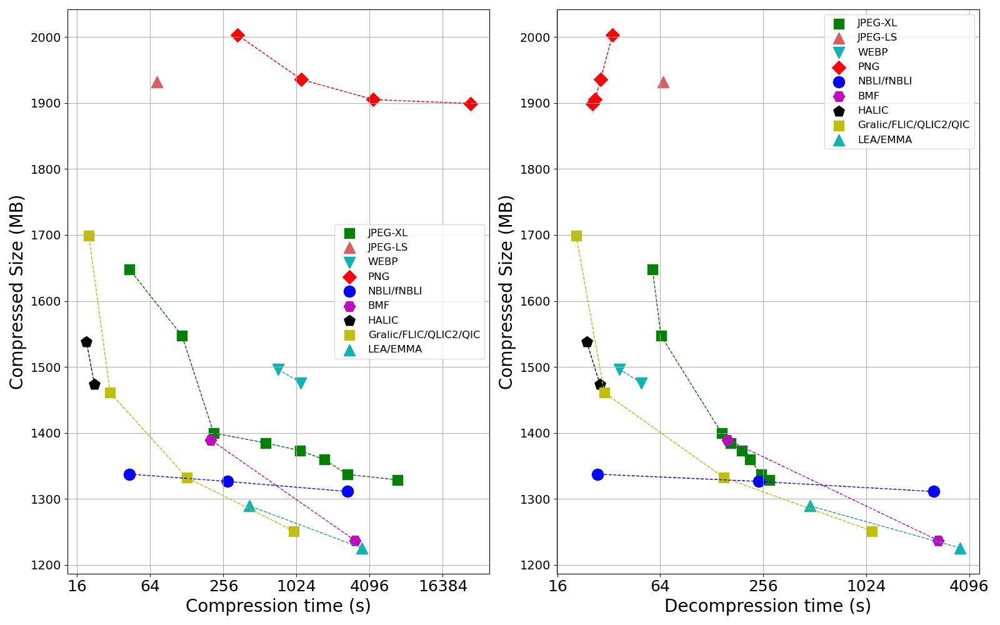
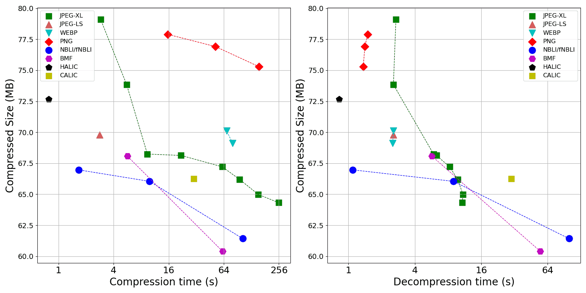

# Lossless Image Compression Benchmark

A comparison of 20+ lossless image compression formats on several datasets.

- **Compress Formats**:
  - PNG, JPEG-LS, JPEG-XL, WEBP, etc. See [**Format List**](#FormatList) for details.
  - All formats are in **strictly lossless compression mode**.
- **Comparison Metrics**:
  - Compressed Size (the smaller the better)
  - Compress Time (the smaller the better)
  - Decompress Time (the smaller the better)
- **Benchmark datasets**:
  - [**CLIC2021**](#dataset_CLIC2021): RGB 24-bit, 585 images, 4.1 GB
  - [**LPCB**](#dataset_LPCB): RGB 24-bit, 107 images, 3.5 GB
  - [**GDCC2020**](#dataset_GDCC2020): RGB 24-bit, 100 images, 1.0 GB
  - [**UCID**](#dataset_UCID): RGB 24-bit, 1338 images, 789 MB
  - [**ImgInfoRGB**](#dataset_ImgInfoRGB): RGB 24-bit, 14 images, 470 MB
  - [**ImgInfoGray**](#dataset_ImgInfoGray): Gray 8-bit, 15  images, 163 MB
  - [**Kodak**](#dataset_Kodak): RGB 24-bit, 24 images, 28 MB
  - All benchmark images are in **.pnm** format (a simple image format which stores raw pixels), see [PNM file spec](https://netpbm.sourceforge.net/doc/pnm.html) for detail.
- **Environment**:
  - Intel Core i7 12700H, 16GB DDR4 in 3200MHz, Windows 10 system.
  - All codecs run in single threaded, but SIMD (AVX2,AVX,SSE4,SSSE3,SSE3,SSE2,SSE) is permitted. This rule is as same as the [GDCC competition](https://globalcompetition.compression.ru/).
- **Benchmark Steps**: 
  - Step1: compress all **.pnm** images one-by-one in a specified folder. The compressed files will be stored in another folder. Measure the total compress time and the total compressed size.
  - Step2: decompress them back to **.pnm** one-by-one. Measure the total decompress time.
  - The above steps are done by a Python script, See [**How to run benchmark**](#HowTo) .
  - For datasets that have small images (UCID, Kodak, etc.), program startup time accounts for a significant portion of compression/decompression time. On the contrary, time consumption on large images can better reflect the true performance of the codecs.

　

　

# CLIC2021 (RGB, 585 images, 4.1 GB)

| Compressed format     | Compressed size (bytes) | Compression Time | Decompression Time |
| :-------------------- |  ---------------------: |  --------------: |  -------------:  |
| EMMA                  | 1225773646              |    3516.354      |    3628.995      |
| BMF     (-s)          | 1237071108              |    3101.102      |    2705.834      |
| Gralic                | 1251405148              |     969.423      |    1109.887      |
| LEA                   | 1289467320              |     419.658      |     481.112      |
| NBLI    (-ga)         | 1311265320              |    2695.927      |    2536.709      |
| NBLI    (-g)          | 1326544840              |     277.564      |     240.414      |
| JPEG-XL (-q 100 -e 8) | 1328936777              |    6936.972      |     278.855      |
| FLIC                  | 1332363598              |     128.098      |     150.450      |
| JPEG-XL (-q 100 -e 7) | 1337119292              |    2684.973      |     249.359      |
| fNBLI                 | 1337587020              |      43.164      |      27.450      |
| JPEG-XL (-q 100 -e 6) | 1359767682              |    1728.935      |     214.077      |
| JPEG-XL (-q 100 -e 5) | 1373095937              |    1099.045      |     192.344      |
| JPEG-XL (-q 100 -e 4) | 1385013285              |     567.416      |     165.030      |
| BMF                   | 1389521424              |     201.699      |     158.537      |
| JPEG-XL (-q 100 -e 3) | 1399673135              |     213.004      |     146.406      |
| QLIC2                 | 1461101919              |      29.899      |      30.152      |
| BIM                   | 1472723769              |     187.279      |     211.560      |
| HALIC                 | 1473481803              |      22.187      |      28.447      |
| WEBP    (lossless m5) | 1475908700              |    1112.134      |      49.442      |
| WEBP    (lossless m1) | 1496478650              |     720.160      |      37.044      |
| PGLZ                  | 1523790711              |      39.912      |      39.076      |
| agiannis_image        | 1534353841              |     103.573      |      56.959      |
| HALICfast             | 1537725512              |      19.112      |      23.784      |
| JPEG-XL (-q 100 -e 2) | 1547272952              |     116.894      |      64.679      |
| JPEG-XL (-q 100 -e 1) | 1648242164              |      42.993      |      57.650      |
| QIC                   | 1699046729              |      19.942      |      20.639      |
| ZPNG    (-19)         | 1703197687              |    1529.037      |      20.486      |
| ZPNG                  | 1755786378              |      25.909      |      24.083      |
| PNG     (optipng -o5) | 1899273578              |   27680.424      |      25.799      |
| PNG     (optipng -o2) | 1905215734              |    4395.069      |      26.625      |
| JPEG-LS               | 1931584595              |      72.237      |      66.567      |
| PNG  (optimize=True)  | 1935713540              |    1120.213      |      28.635      |
| JPEG2000              | 1992860964              |     319.912      |     275.398      |
| PNG  (optimize=False) | 2003016524              |     334.791      |      33.677      |
| QOIR                  | 2139350533              |      23.696      |      19.752      |
| QOI                   | 2280217586              |      19.061      |      18.970      |
| (uncompressed)        | 4091841959              |                  |                  |
| KVICK                 | -                       | *(1)*            |      -           |

> *(1)* KVICK failed to compress 006.pnm

|                                |
| :------------------------------------------------------------: |
| Figure: result on CLIC2021. The bottom left corner is optimal. |

　

# LPCB (RGB, 107 images, 3.5 GB)

Note: My LPCB is **slightly different** from the [LPCB by Alex Rhatushnyak](http://qlic.altervista.org/). This is because the astronomical photo website mentioned by Alex has changed, and the images I found are not exactly the same as the ones Alex downloaded.

| Compressed format     | Compressed size (bytes) | Compression Time | Decompression Time |
| :-------------------- |  ---------------------: |  --------------: |  -------------:  |
| EMMA                  | 1036818025              |    2691.033      |    2770.494      |
| Gralic                | 1048182107              |     775.997      |     956.626      |
| BMF     (-s)          | 1066246568              |    1437.759      |    1195.213      |
| LEA                   | 1100914622              |     334.653      |     381.128      |
| FLIC                  | 1115213038              |      99.498      |     121.001      |
| JPEG-XL (-q 100 -e 8) | 1158622694              |    7057.548      |     217.006      |
| JPEG-XL (-q 100 -e 7) | 1168292454              |    4230.815      |     214.368      |
| NBLI    (-ga)         | 1191831264              |    2182.471      |    2127.896      |
| JPEG-XL (-q 100 -e 6) | 1194089387              |    2109.277      |     192.291      |
| NBLI    (-g)          | 1204941968              |     223.196      |     203.809      |
| JPEG-XL (-q 100 -e 5) | 1205466235              |    1133.894      |     163.855      |
| fNBLI                 | 1206328342              |      31.186      |      19.763      |
| BMF                   | 1213482896              |     158.939      |     127.096      |
| BIM                   | 1213999031              |     132.307      |     146.417      |
| QLIC2                 | 1230029495              |      17.204      |      17.549      |
| JPEG-XL (-q 100 -e 4) | 1245721128              |     504.058      |     134.691      |
| JPEG-XL (-q 100 -e 3) | 1253349539              |     182.373      |     121.771      |
| HALIC                 | 1276696476              |      11.924      |      16.741      |
| WEBP    (lossless m5) | 1300680056              |     791.147      |      29.433      |
| PGLZ                  | 1301944148              |      27.126      |      26.281      |
| WEBP    (lossless m1) | 1303211906              |     592.651      |      29.480      |
| JPEG-LS               | 1327637376              |      64.657      |      55.492      |
| QIC                   | 1354727915              |      12.537      |      13.886      |
| JPEG-XL (-q 100 -e 2) | 1361425125              |      98.402      |      50.620      |
| agiannis_image        | 1362022308              |      81.501      |      41.724      |
| JPEG2000              | 1365795431              |     226.687      |     190.900      |
| HALICfast             | 1374530831              |       8.465      |      12.056      |
| JPEG-XL (-q 100 -e 1) | 1448544947              |      33.212      |      45.526      |
| PNG  (optimize=True)  | 1490076168              |    1101.140      |      28.085      |
| PNG  (optimize=False) | 1510328261              |     432.272      |      31.353      |
| ZPNG    (-19)         | 1591546396              |    1662.847      |      14.159      |
| ZPNG                  | 1629453203              |      14.175      |      13.586      |
| QOIR                  | 1958364213              |      12.993      |      11.817      |
| QOI                   | 2126443598              |      13.070      |      10.921      |
| (uncompressed)        | 3465001880              |                  |                  |
| KVICK                 | -                       | *(1)*            | -                |

> *(1)* KVICK failed to compress PIA12811.pnm

　

# GDCC2020 (RGB, 100 images, 1.0 GB)

| Compressed format     | Compressed size (bytes) | Compression Time | Decompression Time |
| :-------------------- |  ---------------------: |  --------------: |  -------------:  |
| EMMA                  | 379524924               |     863.205      |    1020.836      |
| BMF     (-s)          | 386757828               |     663.119      |     562.053      |
| Gralic                | 388573995               |     255.479      |     314.850      |
| LEA                   | 393734234               |      99.750      |     113.185      |
| FLIC                  | 408829774               |      31.036      |      37.816      |
| JPEG-XL (-q 100 -e 8) | 415853862               |    1693.581      |      54.970      |
| JPEG-XL (-q 100 -e 7) | 420333004               |     843.821      |      57.939      |
| NBLI    (-g)          | 423628470               |      67.490      |      61.712      |
| BMF                   | 424784116               |      51.287      |      40.035      |
| fNBLI                 | 426404724               |      10.424      |       6.445      |
| JPEG-XL (-q 100 -e 6) | 428397642               |     544.115      |      53.412      |
| BIM                   | 429116636               |      46.124      |      51.381      |
| KVICK                 | 431072269               |       8.663      |       6.568      |
| HALIC                 | 431969273               |       4.780      |       5.426      |
| JPEG-XL (-q 100 -e 5) | 435250607               |     320.977      |      47.615      |
| QLIC2                 | 437196023               |       6.228      |       6.076      |
| WEBP    (lossless m5) | 439471254               |     209.927      |       8.951      |
| WEBP    (lossless m1) | 440863674               |     155.297      |       8.827      |
| PGLZ                  | 443858508               |       9.078      |       8.980      |
| JPEG-XL (-q 100 -e 4) | 447106848               |     141.131      |      38.298      |
| JPEG-XL (-q 100 -e 3) | 452630153               |      56.515      |      36.675      |
| agiannis_image        | 459627059               |      25.913      |      12.938      |
| HALIC fast            | 471762927               |       3.612      |       4.336      |
| JPEG-XL (-q 100 -e 2) | 475122224               |      31.765      |      16.411      |
| JPEG-LS               | 475130770               |      19.959      |      17.375      |
| JPEG2000              | 480898833               |      75.909      |      64.687      |
| QIC                   | 485295948               |       4.740      |       4.827      |
| JPEG-XL (-q 100 -e 1) | 502488052               |      10.900      |      14.519      |
| PNG     (optipng -o2) | 504232363               |     888.782      |       6.737      |
| PNG  (optimize=True)  | 507730837               |     393.538      |       9.439      |
| ZPNG    (-19)         | 520866305               |     481.722      |       5.243      |
| PNG  (optimize=False) | 521104646               |     152.321      |      11.545      |
| ZPNG                  | 522105496               |       5.415      |       5.415      |
| QOIR                  | 636806762               |       5.274      |       4.323      |
| QOI                   | 711448440               |       4.782      |       4.174      |
| (uncompressed)        | 1000452004              |                  |                  |

　

# UCID (RGB, 1338 images, 789 MB)

| Compressed format     | Compressed size (bytes) | Compression Time | Decompression Time |
| :-------------------- |  ---------------------: |  --------------: |  -------------:  |
| BMF     (-s)          | 358264156               |     834.324      |     670.095      |
| EMMA                  | 363146061               |     920.573      |     928.970      |
| Gralic                | 369197501               |     265.551      |     317.041      |
| NBLI    (-ga)         | 380732288               |     527.418      |     511.814      |
| LEA                   | 381210845               |     107.675      |     122.336      |
| NBLI    (-g)          | 385032950               |      80.619      |      72.041      |
| JPEG-XL (-q 100 -e 8) | 387729500               |     924.796      |      78.085      |
| JPEG-XL (-q 100 -e 7) | 388847068               |     437.730      |      69.819      |
| fNBLI                 | 388972444               |      31.778      |      29.935      |
| FLIC                  | 389542845               |      49.401      |      54.689      |
| JPEG-XL (-q 100 -e 6) | 389697195               |     346.064      |      68.097      |
| JPEG-XL (-q 100 -e 5) | 390945098               |     276.063      |      65.543      |
| BMF                   | 394237756               |      72.209      |      56.953      |
| JPEG-XL (-q 100 -e 4) | 394648213               |     167.984      |      66.721      |
| JPEG-XL (-q 100 -e 3) | 397914156               |      76.662      |      52.454      |
| WEBP    (lossless m5) | 406249060               |     276.430      |      15.349      |
| HALIC                 | 418177967               |      26.296      |      27.210      |
| WEBP    (lossless m1) | 418215900               |      74.712      |      15.007      |
| JPEG-XL (-q 100 -e 2) | 419778646               |      56.511      |      34.241      |
| HALIC fast            | 427874313               |      25.803      |      26.755      |
| agiannis_image        | 429965785               |      27.445      |      23.010      |
| BIM                   | 430413578               |      78.640      |      86.367      |
| QIC                   | 433289358               |      22.767      |      22.671      |
| JPEG-LS               | 440319498               |      17.452      |      25.369      |
| JPEG-XL (-q 100 -e 1) | 441898560               |      32.982      |      35.540      |
| PGLZ                  | 455612648               |      20.632      |      22.145      |
| JPEG2000              | 457705965               |      71.376      |      79.671      |
| ZPNG                  | 465688194               |      26.165      |      25.219      |
| ZPNG    (-19)         | 471879020               |     199.138      |      21.903      |
| PNG     (optipng -o2) | 472478228               |     434.690      |       7.317      |
| PNG  (optimize=True)  | 474760958               |     103.002      |      17.805      |
| PNG  (optimize=False) | 478891722               |      63.322      |      15.219      |
| QOIR                  | 550136053               |      30.130      |      26.880      |
| QOI                   | 607364567               |      21.458      |      21.089      |
| (uncompressed)        | 789204582               |                  |                  |
| QLIC2                 |   -                     | *(1)*            |     -            |
| KVICK                 |   -                     | *(2)*            |     -            |

> *(1)* QLIC2 failed to compress 534.pnm
> *(2)* KVICK failed to compress 1.pnm

　

# ImgInfoRGB (RGB, 14 images, 470 MB)

| Compressed format     | Compressed size (bytes) | Compression Time | Decompression Time |
| :-------------------- |  ---------------------: |  --------------: |  -------------:  |
| EMMA                  | 172116925               |     703.414      |     738.327      |
| Gralic                | 175677261               |     153.530      |     182.790      |
| BMF     (-s)          | 176768000               |     275.041      |     251.288      |
| LEA                   | 178618702               |      49.706      |      57.624      |
| FLIC                  | 185321411               |      13.270      |      16.422      |
| JPEG-XL (-q 100 -e 8) | 186960454               |    1488.070      |      27.771      |
| JPEG-XL (-q 100 -e 7) | 189299631               |     769.875      |      27.986      |
| NBLI    (-ga)         | 190777948               |     324.221      |     369.493      |
| JPEG-XL (-q 100 -e 6) | 191731771               |     452.414      |      25.350      |
| NBLI    (-g)          | 191823292               |      30.897      |      27.857      |
| BIM                   | 192502555               |      20.246      |      22.427      |
| fNBLI                 | 192748564               |       4.241      |       2.553      |
| JPEG-XL (-q 100 -e 5) | 192905157               |     195.554      |      23.411      |
| BMF                   | 193508124               |      20.375      |      17.591      |
| QLIC2                 | 197323879               |       2.216      |       2.253      |
| JPEG-XL (-q 100 -e 4) | 200412667               |      76.057      |      17.968      |
| JPEG-XL (-q 100 -e 3) | 201748650               |      24.390      |      17.011      |
| KVICK                 | 201956671               |       3.613      |       2.604      |
| HALIC                 | 202316277               |       1.600      |       2.265      |
| PGLZ                  | 207414232               |       3.575      |       3.946      |
| WEBP    (lossless m1) | 208436854               |      67.416      |       3.965      |
| WEBP    (lossless m5) | 208701058               |     113.581      |       4.246      |
| JPEG-LS               | 210207314               |       9.251      |       7.774      |
| agiannis_image        | 212204991               |      12.762      |       6.055      |
| HALIC fast            | 212449559               |       1.098      |       1.597      |
| JPEG-XL (-q 100 -e 2) | 215584397               |      13.211      |       6.823      |
| JPEG2000              | 215755895               |      34.656      |      28.867      |
| QIC                   | 217245358               |       1.630      |       1.719      |
| JPEG-XL (-q 100 -e 1) | 225636447               |       4.358      |       5.822      |
| PNG     (optipng -o2) | 227065671               |     503.217      |       4.723      |
| PNG  (optimize=True)  | 229775662               |     173.874      |       4.836      |
| PNG  (optimize=False) | 232490257               |      56.013      |       4.179      |
| ZPNG    (-19)         | 243165956               |     361.250      |       1.887      |
| ZPNG                  | 244474468               |       1.808      |       1.984      |
| QOIR                  | 294274639               |       1.875      |       1.630      |
| QOI                   | 334452517               |       1.757      |       1.544      |
| (uncompressed)        | 470611702               |                  |                  |

　

# ImgInfoGray (Gray, 15  images, 163 MB)

| Compressed format     | Compressed size (bytes) | Compression Time | Decompression Time |
| :-------------------- | ----------------------: | ---------------: | --------------:  |
| BMF     (-s)          | 60403420                |      61.979      |      54.852      |
| NBLI    (-ga)         | 61430246                |     113.289      |      96.770      |
| JPEG-XL (-q 100 -e 8) | 64319725                |     255.151      |      10.765      |
| JPEG-XL (-q 100 -e 7) | 64989286                |     152.180      |      10.941      |
| NBLI    (-g)          | 66042412                |       9.885      |       8.971      |
| JPEG-XL (-q 100 -e 6) | 66197131                |      95.373      |       9.791      |
| CALIC                 | 66268081                |      30.148      |      29.928      |
| fNBLI                 | 66969784                |       1.663      |       1.096      |
| JPEG-XL (-q 100 -e 5) | 67216341                |      61.613      |       8.278      |
| JPEG-LS_extension     | 67417838                |      21.898      |      20.274      |
| BMF                   | 68071428                |       5.667      |       5.726      |
| JPEG-XL (-q 100 -e 3) | 68132590                |       9.362      |       5.913      |
| JPEG-XL (-q 100 -e 4) | 68244348                |      21.877      |       6.283      |
| WEBP    (lossless m5) | 69126892                |      79.890      |       2.523      |
| JPEG-LS               | 69812230                |       2.826      |       2.559      |
| WEBP    (lossless m1) | 70125250                |      68.650      |       2.558      |
| JPEG2000              | 70540445                |      10.637      |       8.933      |
| HALIC                 | 72653019                |       0.783      |       0.822      |
| JPEG-XL (-q 100 -e 2) | 73845515                |       5.559      |       2.560      |
| PNG     (optipng -o2) | 75293445                |     155.168      |       1.364      |
| PNG  (optimize=True)  | 76913530                |      51.972      |       1.411      |
| PNG  (optimize=False) | 77898260                |      15.660      |       1.497      |
| JPEG-XL (-q 100 -e 1) | 79114669                |       2.885      |       2.698      |
| ZPNG (-19)            | 79121105                |      64.063      |       0.872      |
| ZPNG                  | 84314703                |       1.020      |       0.894      |
| (uncompressed)        | 162870743               |                  |                  |
| HALIC fast            | -                       |       -          | *(1)*            |
| MRP                   | -                       |       *(2)*      |   -              |

> *(1)* HALIC fast failed to decompress zone_plate.pnm
> *(2)* To be tested, extremely slow

|                             |
| :---------------------------------------------------------------: |
| Figure: result on ImgInfoGray. The bottom left corner is optimal. |

　

# Kodak (RGB, 24 images, 28 MB)

| Compressed format     | Compressed size (bytes) | Compression Time | Decompression Time |
| :-------------------- |  ---------------------: |  --------------: |  -------------:  |
| EMMA                  | 9214201                 |      29.774      |      32.548      |
| BMF     (-s)          | 9595728                 |      25.601      |      21.643      |
| LEA                   | 9789610                 |       3.560      |       4.030      |
| Gralic                | 9918007                 |       8.051      |       9.635      |
| JPEG-XL (-q 100 -e 7) | 10269584                |      16.411      |       2.523      |
| JPEG-XL (-q 100 -e 8) | 10293368                |      41.413      |       2.869      |
| JPEG-XL (-q 100 -e 6) | 10413010                |      11.459      |       2.567      |
| NBLI    (-ga)         | 10522506                |      20.149      |      17.895      |
| NBLI    (-g)          | 10681546                |       2.361      |       2.233      |
| JPEG-XL (-q 100 -e 5) | 10820750                |       8.316      |       2.174      |
| fNBLI                 | 10822082                |       0.667      |       0.592      |
| FLIC                  | 10943582                |       1.199      |       1.371      |
| BMF                   | 10985752                |       3.161      |       1.987      |
| JPEG-XL (-q 100 -e 4) | 11043358                |       5.025      |       1.986      |
| JPEG-XL (-q 100 -e 3) | 11134817                |       2.177      |       1.578      |
| WEBP    (lossless m5) | 11286614                |      35.244      |       0.565      |
| WEBP    (lossless m1) | 11548904                |       5.625      |       0.561      |
| QLIC2                 | 11725663                |       0.580      |       0.544      |
| HALIC                 | 11913726                |       0.571      |       0.615      |
| KVICK                 | 12122924                |       0.685      |       0.599      |
| JPEG-XL (-q 100 -e 2) | 12162795                |       1.469      |       0.908      |
| HALIC fast            | 12180926                |       0.543      |       0.585      |
| agiannis_image        | 12183582                |       0.959      |       0.631      |
| BIM                   | 12341836                |       2.434      |       2.904      |
| PGLZ                  | 12474362                |       0.621      |       0.510      |
| JPEG-XL (-q 100 -e 1) | 12881788                |       0.876      |       0.997      |
| ZPNG    (-19)         | 13259943                |       8.611      |       0.699      |
| ZPNG                  | 13529787                |       0.971      |       0.809      |
| QIC                   | 13742536                |       0.504      |       0.523      |
| QOIR                  | 15133821                |       0.792      |       0.640      |
| JPEG-LS               | 15421702                |       0.813      |       0.817      |
| PNG     (optipng -o2) | 15497043                |      19.693      |       0.242      |
| PNG  (optimize=True)  | 15809578                |       6.587      |       0.365      |
| JPEG2000              | 15869636                |       3.307      |       2.994      |
| PNG  (optimize=False) | 15941575                |       4.030      |       0.484      |
| QOI                   | 16501328                |       0.668      |       0.638      |
| (uncompressed)        | 28311912                |                  |                  |

　

　

　

# <span id="FormatList">Format List</span>

There are 3 types of codecs (coder/decoder):

- Most of them are Windows executable files (\.EXE). I put them in the [codec](./codec) folder.
- Some of them are Linux binary files which runs under Windows Subsystem of Linux ([WSL](https://learn.microsoft.com/zh-cn/windows/wsl/install)). I put them in the [codec](./codec) folder.
- Some of them are [Pillow 10.1.0 library](https://pillow.readthedocs.io/en/stable/handbook/image-file-formats.html) , e.g., for PNG:
  - To compress, run this in Python: `Image.open(r"in.pnm").save(r"comp.png")`
  - To decompress, run this in Python:  `Image.open(r"comp.png").save(r"out.pnm")`

Note: If you want to add any other formats, please submit an issue.

| Name                                                         |                        Spec / Author                         | path in this benchmark                                       |    open source?    |    gray 8-bit ?    |    RGB 24-bit ?    |
| :----------------------------------------------------------- | :----------------------------------------------------------: | :----------------------------------------------------------- | :----------------: | :----------------: | :----------------: |
| [**PNG**](https://pillow.readthedocs.io/en/stable/handbook/image-file-formats.html#png) |   [RFC 2083](https://www.rfc-editor.org/rfc/rfc2083.html)    | [python pillow](https://pillow.readthedocs.io/en/stable/handbook/image-file-formats.html#png) | :heavy_check_mark: | :heavy_check_mark: | :heavy_check_mark: |
| [**PNG**](https://optipng.sourceforge.net/) ([optipng](https://optipng.sourceforge.net/) 0.7.7) |   [RFC 2083](https://www.rfc-editor.org/rfc/rfc2083.html)    | `./codec/PNG/`                                               | :heavy_check_mark: | :heavy_check_mark: | :heavy_check_mark: |
| [**WEBP**](https://en.wikipedia.org/wiki/WebP)               | [Google website](https://developers.google.com/speed/webp/docs/riff_container) | [python pillow](https://pillow.readthedocs.io/en/stable/handbook/image-file-formats.html#webp) | :heavy_check_mark: | :heavy_check_mark: | :heavy_check_mark: |
| [**JPEG2000**](https://pillow.readthedocs.io/en/stable/handbook/image-file-formats.html#jpeg-2000) |                       ISO/IEC 15444-1                        | [python pillow](https://pillow.readthedocs.io/en/stable/handbook/image-file-formats.html#jpeg-2000) | :heavy_check_mark: | :heavy_check_mark: | :heavy_check_mark: |
| [**JPEG-LS**](http://www.stat.columbia.edu/~jakulin/jpeg-ls/mirror.htm) |                          ITU-T T.87                          | [python pillow](https://pypi.org/project/pillow-jpls/)       | :heavy_check_mark: | :heavy_check_mark: | :heavy_check_mark: |
| [**JPEG-XL**](https://github.com/libjxl/libjxl/releases) v0.9.0 *(1)* |                        ISO/IEC 18181                         | `./codec/JPEG-XL/`                                           | :heavy_check_mark: | :heavy_check_mark: | :heavy_check_mark: |
| [**QOI**](https://qoiformat.org/)                            | [D. Szablewski](https://qoiformat.org/qoi-specification.pdf) | `./codec/QOI/`                                               | :heavy_check_mark: |        :x:         | :heavy_check_mark: |
| [**QOIR**](https://github.com/nigeltao/qoir)                 |           [Nigel Tao](https://github.com/nigeltao)           | `./codec/QOIR/`                                              | :heavy_check_mark: |        :x:         | :heavy_check_mark: |
| [**ZPNG**](https://github.com/catid/Zpng)                    |           [Chris Taylor](https://github.com/catid)           | `./codec/ZPNG/`                                              | :heavy_check_mark: | :heavy_check_mark: | :heavy_check_mark: |
| [**NBLI**](https://github.com/WangXuan95/NBLI) v0.4          |           [X.Wang](https://github.com/WangXuan95)            | `./codec/NBLI/`                                              | :heavy_check_mark: | :heavy_check_mark: | :heavy_check_mark: |
| [**fNBLI**](https://github.com/WangXuan95/NBLI) v0.4         |           [X.Wang](https://github.com/WangXuan95)            | `./codec/NBLI/`                                              |        :x:         | :heavy_check_mark: | :heavy_check_mark: |
| [**HALIC**](https://github.com/Hakan-Abbas/HALIC-High-Availability-Lossless-Image-Compression-/releases/tag/0.7.2) 0.7.2 |        [Hakan Abbas](https://github.com/Hakan-Abbas)         | `./codec/HALIC/`                                             |        :x:         | :heavy_check_mark: | :heavy_check_mark: |
| [**BMF**](http://compression.ru/compression.ru/ds/) v2.01    |  [Dmitry Shkarin](http://compression.ru/compression.ru/ds/)  | `./codec/BMF/`                                               |        :x:         | :heavy_check_mark: | :heavy_check_mark: |
| [**EMMA**](https://globalcompetition.compression.ru/assets/files/compressors/) |     [Marcio Pais](https://encode.su/members/4093-mpais)      | `./codec/EMMA/`                                              |        :x:         |        :x:         | :heavy_check_mark: |
| [**LEA**](https://encode.su/threads/3818-LEA-Lossless-image-compressor) v0.6 beta |     [Marcio Pais](https://encode.su/members/4093-mpais)      | `./codec/LEA/`                                               |        :x:         |        :x:         | :heavy_check_mark: |
| [**Gralic**](http://www.imagecompression.info/gralic/Gralic111d.zip) v1.11 | [Alex Rhatushnyak](https://www.linkedin.com/in/theinventor/) | `./codec/GRALIC/`                                            |        :x:         |        bug?        | :heavy_check_mark: |
| [**FLIC**](http://www.imagecompression.info/gralic/flic21d.zip) v2.1 | [Alex Rhatushnyak](https://www.linkedin.com/in/theinventor/) | `./codec/FLIC/`                                              |        :x:         |        :x:         | :heavy_check_mark: |
| [**QLIC2**](http://qlic.altervista.org/qlic2d.zip) v2        | [Alex Rhatushnyak](https://www.linkedin.com/in/theinventor/) | `./codec/QLIC2/`                                             |        :x:         |        :x:         | :heavy_check_mark: |
| [**QIC**](http://www.imagecompression.info/gralic/qic1d.zip) v1 | [Alex Rhatushnyak](https://www.linkedin.com/in/theinventor/) | `./codec/QIC/`                                               |        :x:         |        :x:         | :heavy_check_mark: |
| [**BIM**](https://compressme.net/) v0.03                     |           [Ilya Muravyov](https://compressme.net/)           | `./codec/BIM/`                                               |        :x:         |        :x:         | :heavy_check_mark: |
| [**KVICK**](https://globalcompetition.compression.ru/assets/files/compressors) | [A. Debski](https://www.linkedin.com/in/andreas-debski-b606021a1/) | `./codec/KVICK/`                                             |        :x:         |        :x:         | :heavy_check_mark: |
| [**PGLZ**](https://globalcompetition.compression.ru/assets/files/compressors) |                         Peter Thamm                          | `./codec/PGLZ/`                                              |        :x:         |        :x:         | :heavy_check_mark: |
| [**agiannis_image**](https://globalcompetition.compression.ru/assets/files/compressors) |        [K. Agiannis](https://github.com/algorithm314)        | `./codec/agiannis_image/`                                    |        :x:         |        :x:         | :heavy_check_mark: |
| [**JPEG-LS-ext**](https://github.com/WangXuan95/ImCvt)       |                         ITU-T T.870                          | `./codec/QOI/`                                               | :heavy_check_mark: | :heavy_check_mark: |        :x:         |
| [**CALIC**](https://www.ece.mcmaster.ca/~xwu/)               | [X. Wu et al.](https://ieeexplore.ieee.org/document/585919)  | `./codec/CALIC/`                                             |        :x:         | :heavy_check_mark: |        :x:         |
| [**MRP**](https://www.rs.tus.ac.jp/matsuda-lab/matsuda/mrp/index.html) v0.5 *(2)* | [I. Matsuda et al.](https://ieeexplore.ieee.org/document/7078076) | `./codec/MRP/`                                               | :heavy_check_mark: | :heavy_check_mark: |        :x:         |

> *(1)*: The well-known **FLIF** (Free Lossless Image Format) was superseded by **JPEG-XL**.*
> *(2)*: MRP can only compress gray 8-bit images with size multiple of 8.*

　

## The commands to compress:

| Codec             | Command to compress                                          |
| :---------------- | :----------------------------------------------------------- |
| PNG (optipng)     | `optipng.exe -o2 -force in.pnm -out out.png`                 |
| PNG               | `Image.open('in.pnm').save('out.png', optimize=True)`        |
| PNG               | `Image.open('in.pnm').save('out.png', optimize=False)`       |
| WEBP              | `Image.open('in.pnm').save('out.webp',lossless=True,quality=100,method=5)` |
| JPEG2000          | `Image.open('in.pnm').save('out.j2k',format='JPEG2000',irreversible=False)` |
| JPEG-LS           | `Image.open('in.pnm').save('out.jls',spiff=None)`            |
| JPEG-XL v0.9.0    | `cjxl.exe in.pnm out.jxl -q 100 -e 8 --quiet --num_threads=0` |
| QOI               | `ImCvt.exe in.pnm -o out.qoi`                                |
| QOIR              | `QOIR.exe in.pnm out.qoir`                                   |
| ZPNG (-19)        | `ZPNG.exe -19 in.pnm out.zpng`                               |
| ZPNG              | `ZPNG.exe -c  in.pnm out.zpng`                               |
| NBLI v0.4         | `NBLI.exe -f  in.pnm -o out.nbli`                            |
| fNBLI v0.4        | `fNBLI.exe -f in.pnm -o out.fnbli`                           |
| HALIC v0.7.2      | `HALIC072e.exe in.pnm out.halic`                             |
| HALIC v0.7.2 fast | `HALIC072fe.exe in.pnm out.halic`                            |
| BMF v2.01         | `BMF.exe    -Oout.bmf in.pnm`                                |
| BMF v2.01 (-s)    | `BMF.exe -s -Oout.bmf in.pnm`                                |
| EMMA              | `emma_c.exe in.pnm out.emma`                                 |
| LEA v0.6 beta     | `LEA.exe in.pnm out.lea`                                     |
| Gralic v1.11      | `Gralic111d.exe c out.gralic in.pnm`                         |
| FLIC 2.1          | `FLIC.exe c out.flic in.pnm`                                 |
| QLIC2 v2          | `QLIC2.exe c out.qlic2 in.pnm`                               |
| QIC v1            | `QIC.exe c out.qic in.pnm`                                   |
| BIM v0.03         | `BIM.exe c in.pnm out.bim`                                   |
| KVICK             | `kvick.exe c i out.kvick in.pnm`                             |
| PGLZ              | `PGLZ -c in.pnm out.pglz`                                    |
| agiannis_image    | `agiannis_image c in.pnm out.agiannis_image`                 |
| JPEG-LS-extension | `ImCvt.exe in.pnm -o out.jlsx`                               |
| CALIC             | `python calic.py -e in.pnm out.calic 0`                      |
| MRP v0.5          | `mrp_enc.exe -o in.pnm out.mrp`                              |

　

## The commands to decompress:

| Format            | Command to decompress                             |
| :---------------- | :------------------------------------------------ |
| PNG               | `Image.open('in.png').save('out.pnm')`            |
| WEBP              | `Image.open('in.webp').save('out.pnm')`           |
| JPEG2000          | `Image.open('in.j2k').save('out.pnm')`            |
| JPEG-LS           | `Image.open('in.jls').save('out.pnm')`            |
| JPEG-XL v0.9.0    | `djxl.exe in.jxl out.pnm --quiet --num_threads=0` |
| QOI               | `ImCvt.exe in.qoi -o out.pnm`                     |
| QOIR              | `QOIR.exe in.qoir out.pnm`                        |
| ZPNG              | `ZPNG.exe -d in.zpng out.pnm`                     |
| fNBLI v0.4        | `fNBLI.exe -f in.fnbli out.pnm`                   |
| NBLI v0.4         | `NBLI.exe  -f in.nbli out.pnm`                    |
| HALIC v0.7.2      | `HALIC072d.exe in.halic out.pnm`                  |
| HALIC v0.7.2 fast | `HALIC072fd.exe in.halic out.pnm`                 |
| BMF v2.01         | `BMF.exe -pnm -Oout.pnm in.bmf`                   |
| EMMA              | `emma_d.exe in.emma out.pnm`                      |
| LEA v0.6 beta     | `LEA.exe in.lea out.pnm`                          |
| Gralic v1.11      | `Gralic111d.exe d in.gralic out.pnm`              |
| FLIC 2.1          | `FLIC.exe d in.flic out.pnm`                      |
| QLIC2 v2          | `QLIC2.exe d in.qlic2 out.pnm`                    |
| QIC v1            | `QIC.exe d in.qic out.pnm`                        |
| BIM v0.03         | `BIM.exe d in.bim out.pnm`                        |
| KVICK             | `kvick.exe d i in.kvick out.pnm`                  |
| PGLZ              | `PGLZ -d in.pglz out.pnm`                         |
| agiannis_image    | `agiannis_image d in.agiannis_image out.pnm`      |
| JPEG-LS-extension | `ImCvt.exe in.jlsx -o out.pnm`                    |
| CALIC             | `python calic.py -d in.calic out.raw`             |
| MRP v0.5          | `mrp_dec.exe in.mrp out.pnm`                      |

　

　

　

# <span id="HowTo">How to run benchmark</span>

### Prepare Python in your Windows

The benchmarking script is written in Python3. If you had not install Python3 yet, it is recommended to install [**Anaconda**](https://www.anaconda.com/download) (It seems that you should fill your email to download now). Just select the newest version for Windows (the version was Python 3.12 when I wrote this document).

In this benchmark, some of the formats are compressed using Windows .EXE files (in [./codec/](./codec/) folder), while others are compressed use Python 3.9 with Pillow 10.1.0 library. Therefore, after installing Anaconda, you need to use CMD (command line) to run following commands to install the required packages:

```
python -m pip install Pillow==10.1.0       # for PNG, WEBP, and JPEG2000 compress/decompress
python -m pip install pillow_jpls==1.3.2   # for JPEG-LS compress/decompress
```

### Run a Simple Test

The benchmarking script is [**RunBenchmark.py**](./RunBenchmark.py). Use following command to run:

```
python RunBenchmark.py <image_folder>
```

There must be some **.pnm** image files in <image_folder>, either RGB 24bit-images or Gray 8-bit images. The script will benchmark these images.

For example, I provide two images in [example_image](./example_image) folder, so you can run a simple test on it:

```
python RunBenchmark.py example_image
```

### Specify Codecs

To specify which compression formats to participate in comparison, simply modify the `CODEC_LIST` list in [RunBenchmark.py](./RunBenchmark.py) (just comment/uncomment corresponding lines).

### Run Benchmarks

Just prepare more **.pnm** images in a folder, and run the [RunBenchmark.py](./RunBenchmark.py).

　

　

　

# Get datasets

### <span id="dataset_CLIC2021">CLIC2021</span>

CLIC2021 dataset has 585 RGB 24-bit images totaling 4.1 GB, which is the training set of [CLIC2021 competition](https://clic.compression.cc/2021/tasks/index.html). To get it:

- Download [data.vision.ee.ethz.ch/cvl/clic/professional_train_2020.zip](https://data.vision.ee.ethz.ch/cvl/clic/professional_train_2020.zip)
- Extract the zip, getting 585 .png image files.
- Download and install [NConvert 7.163](https://www.xnview.com/en/nconvert/#downloads). We will use nconvert.exe (You can add it to your Windows environment variable).
- Convert all the downloaded .png images to <b>RGB 24-bit .pnm format</b> using nconvert.exe.
  The method is to run the following command in the directory where the images are located:
  ```
  nconvert.exe -out pnm *.png
  ```
- Put these 585 .pnm files into a folder. 
- Run benchmark.

　

### <span id="dataset_GDCC2020">GDCC2020</span>

GDCC2020 dataset has 100 RGB 24-bit images totaling 1 GB, which is the test set of [GDCC2020 competition](https://globalcompetition.compression.ru/). To get it:

- Download it [from this link](https://drive.google.com/file/d/1whLQmZZaThl_p_lQqwrI8_zO0jooU9VS/).
- Extract it, getting 107 .pnm files.
- Run benchmark.

　

### <span id="dataset_UCID">UCID</span>

UCID dataset has 1338 RGB 24-bit images totaling 789 MB. To get it:

- Download it [from this link](https://video.minelab.tw/DETS/). Please click the link [UCID Database (Zipped)](https://nas.minelab.tw:5001/sharing/LkqugeXkW)
- Extract it, getting 1338 .tif image files.
- Download and install [NConvert 7.163](https://www.xnview.com/en/nconvert/#downloads). We will use nconvert.exe (You can add it to your Windows environment variable).
- Convert all the downloaded .tif images to <b>RGB 24-bit .pnm format</b> using nconvert.exe.
  The method is to run the following command in the directory where the images are located:
  ```
  nconvert.exe -out pnm *.tif
  ```
- Put these 1338 .pnm files into a folder. 
- Run benchmark.

　

### <span id="dataset_ImgInfoRGB">ImgInfoRGB</span>

ImgInfoRGB dataset has 14 RGB 24-bit images totaling 470 MB. To get it:

- Download it [from this link](https://imagecompression.info/test_images/), please click the [RGB 8 bit](https://imagecompression.info/test_images/rgb8bit.zip).
- Extract it, getting 14 .ppm files.
- Rename their file suffix from .ppm to .pnm. (actually ppm and pnm are same file formats)
- Run benchmark.

　

### <span id="dataset_ImgInfoGray">ImgInfoGray</span>

ImgInfoGray dataset has 15 Gray 8-bit images totaling 163 MB. To get it:

- Download it [from this link](https://imagecompression.info/test_images/), please click the [Gray 8 bit](https://imagecompression.info/test_images/gray8bit.zip).
- Extract it, getting 15 .pgm files.
- Rename their file suffix from .pgm to .pnm. (actually pgm and pnm are same file formats)
- Run benchmark.

　

### <span id="dataset_Kodak">Kodak</span>

Kodak dataset has 24 RGB 24-bit images totaling 28 MB. To get it:

- Visit [Kodak True Color Image Suite](https://r0k.us/graphics/kodak/), you will see 24 .png images. Download them one-by-one.
- Download and install [NConvert 7.163](https://www.xnview.com/en/nconvert/#downloads). We will use nconvert.exe (You can add it to your Windows environment variable).
- Convert all the downloaded .png images to <b>RGB 24-bit .pnm format</b> using nconvert.exe.
  The method is to run the following command in the directory where the images are located:
  ```
  nconvert.exe -out pnm *.png
  ```
- Put these 24 .pnm files into a folder. 
- Run benchmark.

　

### <span id="dataset_LPCB">LPCB</span>

LPCB dataset has 107 RGB 24-bit images totaling 3.4 GB, which is similar to the dataset used in [the benchmark by Alex Rhatushnyak](http://qlic.altervista.org/), but not exactly the same. This is because the astronomical photo website mentioned by Alex has changed, and the images I found are not exactly the same as the ones Alex downloaded. The method that Alex described for obtaining LPCB can be found [here](http://qlic.altervista.org/LPCB-data.html).

My LPCB consists of 62 photographs and 45 astronomical images. To get the 62 photographs:

- First, download all the "Sample RAW Images" from the following four sites: <a href="http://www.photographyblog.com/reviews/olympus_xz1_review#sample_images">Olympus</a>, <a href="http://www.photographyblog.com/reviews/sony_a55_review#sample_images">Sony</a>, <a href="http://www.photographyblog.com/reviews/fujifilm_finepix_x100_review#sample_images">Fujifilm</a>, and <a href="http://www.photographyblog.com/reviews/canon_eos_1100d_review#sample_images">Canon</a>. <i>Note: Please find the "Sample RAW Images" section on the webpage to download, rather than the "Sample Images" section.</i>
- After downloading, remove some similar images among them.
  - In <b>Sony</b> set, remove images 12, 13, 14.
  - In <b>Canon</b> set, remove images 7, 8, 9, 10.
  - In <b>Fujifilm</b> set, remove images 7, 8, 9.
  After removing, there are 62 images left.
- Convert these 62 images to <b>24-bit RGB .pnm format</b> using [NConvert 7.163](https://www.xnview.com/en/nconvert/#downloads). The method is to run the following command in the directory where the image is located:
  ```
  nconvert.exe -out pnm -high_res -raw_camerabalance *.orf *.arw *.raf *.cr2
  ```
- List of the 62 test images in LPCB
  ```
    name                         width x height
    canon_eos_1100d_01            4290 x 2856
    canon_eos_1100d_02            2856 x 4290
    canon_eos_1100d_03            4290 x 2856
    canon_eos_1100d_04            4290 x 2856
    canon_eos_1100d_05            4290 x 2856
    canon_eos_1100d_06            2856 x 4290
    canon_eos_1100d_11            4290 x 2856
    canon_eos_1100d_12            4290 x 2856
    canon_eos_1100d_13            2856 x 4290
    canon_eos_1100d_14            4290 x 2856
    canon_eos_1100d_15            2856 x 4290
    fujifilm_finepix_x100_01      4310 x 2870
    fujifilm_finepix_x100_02      4310 x 2870
    fujifilm_finepix_x100_03      2870 x 4310
    fujifilm_finepix_x100_04      2870 x 4310
    fujifilm_finepix_x100_05      2870 x 4310
    fujifilm_finepix_x100_06      2870 x 4310
    fujifilm_finepix_x100_10      4310 x 2870
    fujifilm_finepix_x100_11      4310 x 2870
    fujifilm_finepix_x100_12      4310 x 2870
    fujifilm_finepix_x100_13      2870 x 4310
    fujifilm_finepix_x100_14      4310 x 2870
    fujifilm_finepix_x100_15      4310 x 2870
    olympus_xz1_01                2760 x 3680
    olympus_xz1_02                2760 x 3680
    olympus_xz1_03                2760 x 3680
    olympus_xz1_04                2760 x 3680
    olympus_xz1_05                2760 x 3680
    olympus_xz1_06                3680 x 2760
    olympus_xz1_07                2760 x 3680
    olympus_xz1_08                2760 x 3680
    olympus_xz1_09                2760 x 3680
    olympus_xz1_10                2760 x 3680
    olympus_xz1_11                3680 x 2760
    olympus_xz1_12                3680 x 2760
    olympus_xz1_13                3680 x 2760
    olympus_xz1_14                3680 x 2760
    olympus_xz1_15                3680 x 2760
    olympus_xz1_16                3680 x 2760
    olympus_xz1_17                3680 x 2760
    olympus_xz1_18                2760 x 3680
    olympus_xz1_19                3680 x 2760
    olympus_xz1_20                2760 x 3680
    olympus_xz1_21                2760 x 3680
    olympus_xz1_22                2760 x 3680
    olympus_xz1_23                2760 x 3680
    olympus_xz1_24                2760 x 3680
    olympus_xz1_25                3680 x 2760
    olympus_xz1_26                3680 x 2760
    olympus_xz1_27                2760 x 3680
    sony_a55_01                   4928 x 3280
    sony_a55_02                   4928 x 3280
    sony_a55_03                   4928 x 3280
    sony_a55_04                   4928 x 3280
    sony_a55_05                   4928 x 3280
    sony_a55_06                   3280 x 4928
    sony_a55_07                   4928 x 3280
    sony_a55_08                   3280 x 4928
    sony_a55_09                   4928 x 3280
    sony_a55_10                   3280 x 4928
    sony_a55_11                   4928 x 3280
    sony_a55_15                   3280 x 4928
  ```

To get the 45 astronomical images:

- Download 45 images (.tif) from the following links:
  ```
  https://photojournal.jpl.nasa.gov/tiff/PIA12811.tif
  https://photojournal.jpl.nasa.gov/tiff/PIA12813.tif
  https://photojournal.jpl.nasa.gov/tiff/PIA13452.tif
  https://photojournal.jpl.nasa.gov/tiff/PIA13453.tif
  https://photojournal.jpl.nasa.gov/tiff/PIA13454.tif
  https://photojournal.jpl.nasa.gov/tiff/PIA13455.tif
  https://photojournal.jpl.nasa.gov/tiff/PIA13456.tif
  https://photojournal.jpl.nasa.gov/tiff/PIA13457.tif
  https://photojournal.jpl.nasa.gov/tiff/PIA13458.tif
  https://photojournal.jpl.nasa.gov/tiff/PIA13459.tif
  https://photojournal.jpl.nasa.gov/tiff/PIA13757.tif
  https://photojournal.jpl.nasa.gov/tiff/PIA13771.tif
  https://photojournal.jpl.nasa.gov/tiff/PIA13779.tif
  https://photojournal.jpl.nasa.gov/tiff/PIA13781.tif
  https://photojournal.jpl.nasa.gov/tiff/PIA13782.tif
  https://photojournal.jpl.nasa.gov/tiff/PIA13785.tif
  https://photojournal.jpl.nasa.gov/tiff/PIA13789.tif
  https://photojournal.jpl.nasa.gov/tiff/PIA13799.tif
  https://photojournal.jpl.nasa.gov/tiff/PIA13803.tif
  https://photojournal.jpl.nasa.gov/tiff/PIA13810.tif
  https://photojournal.jpl.nasa.gov/tiff/PIA13812.tif
  https://photojournal.jpl.nasa.gov/tiff/PIA13815.tif
  https://photojournal.jpl.nasa.gov/tiff/PIA13833.tif
  https://photojournal.jpl.nasa.gov/tiff/PIA13843.tif
  https://photojournal.jpl.nasa.gov/tiff/PIA13844.tif
  https://photojournal.jpl.nasa.gov/tiff/PIA13845.tif
  https://photojournal.jpl.nasa.gov/tiff/PIA13855.tif
  https://photojournal.jpl.nasa.gov/tiff/PIA13856.tif
  https://photojournal.jpl.nasa.gov/tiff/PIA13857.tif
  https://photojournal.jpl.nasa.gov/tiff/PIA13859.tif
  https://photojournal.jpl.nasa.gov/tiff/PIA13862.tif
  https://photojournal.jpl.nasa.gov/tiff/PIA13872.tif
  https://photojournal.jpl.nasa.gov/tiff/PIA13882.tif
  https://photojournal.jpl.nasa.gov/tiff/PIA13891.tif
  https://photojournal.jpl.nasa.gov/tiff/PIA13894.tif
  https://photojournal.jpl.nasa.gov/tiff/PIA13900.tif
  https://photojournal.jpl.nasa.gov/tiff/PIA13901.tif
  https://photojournal.jpl.nasa.gov/tiff/PIA13904.tif
  https://photojournal.jpl.nasa.gov/tiff/PIA13908.tif
  https://photojournal.jpl.nasa.gov/tiff/PIA13912.tif
  https://photojournal.jpl.nasa.gov/tiff/PIA13913.tif
  https://photojournal.jpl.nasa.gov/tiff/PIA13914.tif
  https://photojournal.jpl.nasa.gov/tiff/PIA13915.tif
  https://photojournal.jpl.nasa.gov/tiff/PIA13942.tif
  https://photojournal.jpl.nasa.gov/tiff/PIA13943.tif
  ```
- Convert these 45 .tif images to <b>24-bit RGB .pnm format</b> using [NConvert 7.163](https://www.xnview.com/en/nconvert/#downloads). The method is to run the following command in the directory where the image is located:
  ```
  nconvert.exe -out pnm *.tif
  ```

Finally, Put these 62+45 .pnm files to a folder, then run benchmark.

　

### Get more Gray 8-bit datasets

There are not many Gray 8-bit images available online for you to test. To obtain more gray8 images, you can convert the images from <b>RGB 24-bit</b> to <b>Gray 8-bit</b> using [NConvert 7.163](https://www.xnview.com/en/nconvert/#downloads). The method is to run the following command in the directory where the **.pnm** images are located:

```
nconvert.exe -grey 256 -out pnm *.pnm
```

This command may cause the original RGB image file to be replaced. Please make a backup before running it.

　

　

# Acknowledgements

- Thanks [Alex Rhatushnyak](https://www.linkedin.com/in/theinventor/), whose [LPCB benchmark](http://qlic.altervista.org/) inspires this project.
- Thanks [Hakan Abbas](https://github.com/Hakan-Abbas), who provides good advice to this project.
- Thanks to every who develops these image codecs.
